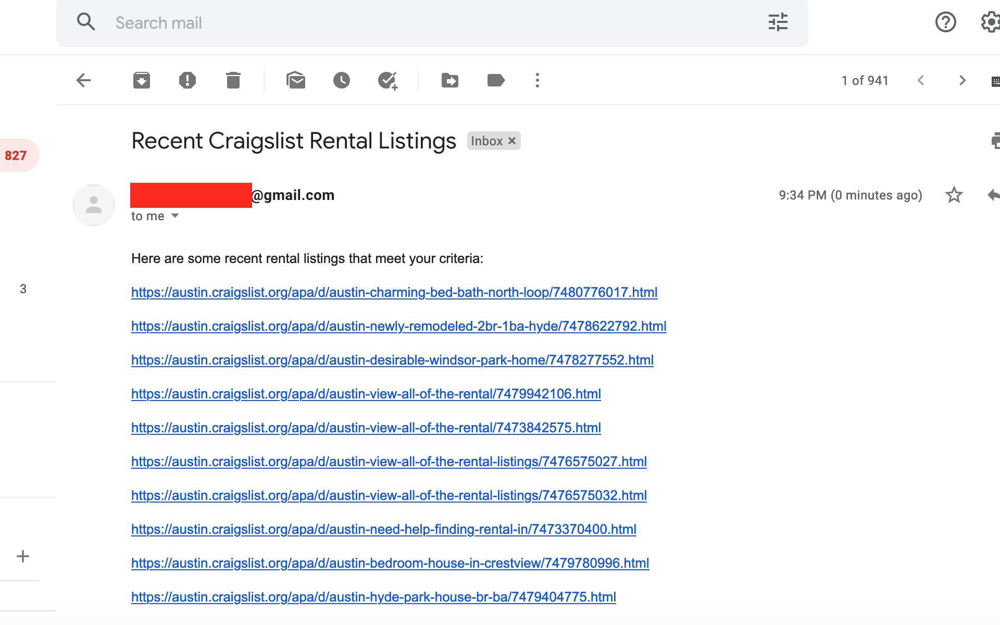

# Craigslist Rental Scraper



This project is an MVP for a later project for scraping rental listings across the web. Right now, it just scrapes the first page provided in the env file. There is no statefulness. We could record scrapped hrefs in a remote server and stop once we see a already scraped href. Also, the filtration is based off the provided link in the env file. We could provide prompts in the terminal for filtrating off certain critera (location, max/min price, etc.) or create a ui. The best approach to use the current implemenation is run off a cron job a couple times a day.

## Why use Docker?
Making sure that your version of node, chrome, and chromedriver all play well together can be quite tricky for scraping projects. We can use docker to specify a specific version of each so we dont' have breaking changes due to incompatible versions.

## Steps To Run

1. Run docker build script with container name. In this example we'll use the name `test`.
```
docker build -t test .
```
2. Start the container with `docker run`.
```
docker run -dp 3000:3000 test
```
3. View output in Docker Desktop app. You should now have a new email with suggested craigslist rental listings.

(Extra: If you use gmail you must enable "Less Secure Apps". It is best to use a burner account instead of your primary email to send messages.)